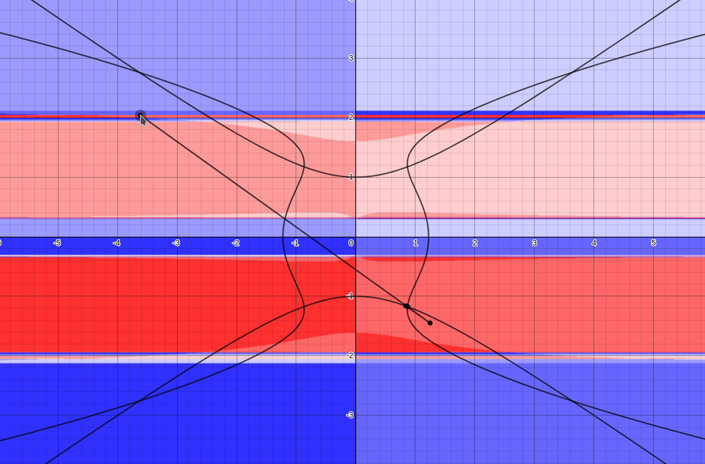
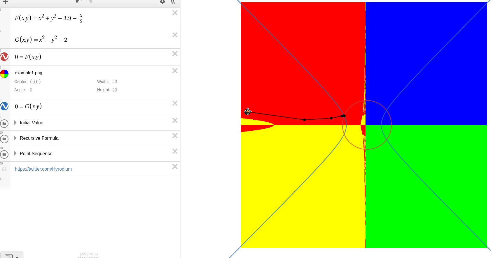
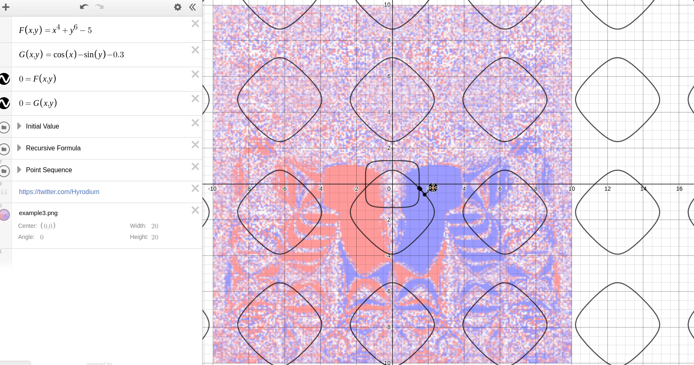

# Visualize2dimNewtonMethod

## Abstract
[Newton-Raphson method](https://en.wikipedia.org/wiki/Newton%27s_method) is a root finding algorithm, and its convergence of is not globally but locally.

This julia code exports a convergence mapping image like this:

And here's a convergence animation by [desmos](https://www.desmos.com/calculator/inpc0d4vgn).

## Gallery

https://www.desmos.com/calculator/fe7sjsg6wd
